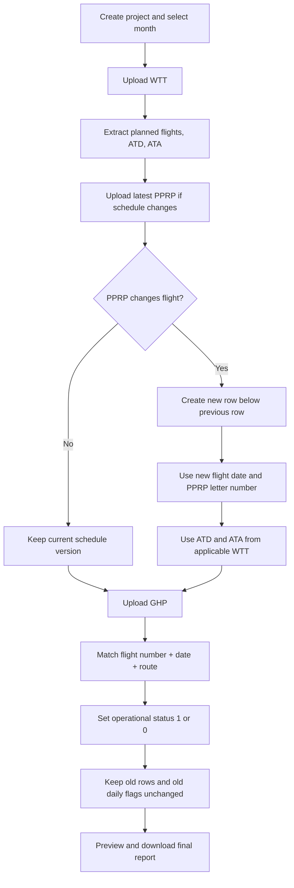

# Functional Specification Document (FSD)

**Module:** Report Extractor  
**Project:** Automated Flight Schedule Reporting System  
**Version:** 3.0  
**Date:** 2026-08-12

## 1. Purpose and Scope

Modul Report Extractor mengelola pekerjaan laporan penerbangan per proyek dan per bulan. Modul membaca WTT, PPRP, dan GHP, mempertahankan histori perubahan jadwal, menampilkan preview, dan menghasilkan final report berdasarkan template Excel otoritas bandara.

## 2. Source-of-Truth Rules

| Source | Format | Usage |
|---|---|---|
| WTT | PDF | Jadwal penerbangan, ATD, dan ATA pada final output |
| PPRP | PDF | Perubahan jadwal resmi, tanggal penerbangan baru, dan nomor surat |
| GHP | Excel | Status operasi `1/0` berdasarkan pencocokan flight, tanggal, dan rute |
| Template final | XLSX | Struktur final report yang tidak boleh diubah |

GHP tidak digunakan sebagai sumber ATD, ATA, atau nilai delay pada final output.

## 3. Business Process

## 4. Project and Monthly Workflow

### FSD-001 — Create Project

The system shall allow an authorized operator to create a project with:

- Project ID.
- Period/season reference.
- Processing year and month.
- Final-output template.

A project may cover one period and is processed month by month.

### FSD-002 — Upload Source Files

The system shall accept source files separately or in combination:

- WTT PDF for the selected month.
- PPRP PDF for the selected month when a change exists.
- GHP Excel for the selected month.

Each upload shall be recorded in the upload log with file name, type, project, month, uploader, timestamp, and processing status.

### FSD-003 — Extract WTT

The system shall extract, at minimum:

- Flight number.
- Origin and destination route.
- Aircraft when available.
- Operating dates or day pattern.
- Planned schedule.
- ATD.
- ATA.

The WTT ATD and ATA values shall be used for the corresponding final-output row. GHP ATD/ATA values shall not overwrite them.

### FSD-004 — Apply PPRP Change

When a PPRP changes a flight, the system shall create a new row directly below the previous row. The new row shall copy the applicable unchanged flight details and replace the following values:

- Flight date, using the new flight date in the latest applicable PPRP.
- PPRP letter number, using the latest applicable PPRP.
- ATD and ATA, using the applicable WTT for the new schedule.

The previous row shall remain stored and visible in the final output without modification.

If a PPRP changes only the time, a new row shall still be created.

### FSD-005 — Calculate GHP Operational Status

The system shall match each schedule-version row to GHP using the exact composite key:

`flight_num + tanggal penerbangan + rute`

Where `rute` represents the applicable origin and destination route.

- Matching GHP record: `status_operasi = 1`.
- No matching GHP record: `status_operasi = 0`.

The system shall not use GHP ATD, ATA, or delay fields to populate final ATD, ATA, or schedule values.

The daily `1/0` values of an existing row are immutable after the row has been generated. A new PPRP row receives its own status values based on its new flight date and route.

### FSD-006 — Preview

The preview shall display, at minimum:

- Schedule version/order.
- Flight number and route.
- Flight date.
- WTT ATD and ATA.
- PPRP number and source month.
- Daily operational flags.
- Source and processing status.

Historical rows shall be visually distinguishable from the latest schedule version and shall be read-only.

### FSD-007 — Generate Final Report

When the operator selects Download, the system shall inject the complete preview dataset into the uploaded final-output template while preserving the template layout, formulas, merged cells, and required formatting.

The final output shall include historical rows and their unchanged daily flags.

## 5. Validation and Exceptions

| ID | Condition | Expected behavior |
|---|---|---|
| FSD-008 | File extension does not match source type | Reject upload and show validation message |
| FSD-009 | WTT cannot be parsed | Mark upload failed; do not generate affected rows |
| FSD-010 | PPRP cannot be parsed | Mark upload failed; preserve existing rows |
| FSD-011 | GHP has no matching row | Set status to `0`; do not clear or alter historical rows |
| FSD-012 | GHP contains a matching row | Set the applicable new/current row to `1` |
| FSD-013 | GHP ATD/ATA differs from WTT | Keep WTT ATD/ATA; record the source mismatch for review if configured |
| FSD-014 | A repeated file is uploaded | Process idempotently and do not create an unintended duplicate version |
| FSD-015 | Required WTT ATD/ATA is unavailable | Mark the affected row incomplete and prevent silent substitution from GHP |

## 6. Final-Output Mapping

| Final-output data | Source | Rule |
|---|---|---|
| Flight number | WTT/PPRP | Latest applicable schedule version |
| Route | WTT/PPRP | Latest applicable schedule version |
| Flight date | WTT/PPRP | PPRP date for a changed row |
| ATD | WTT | Never sourced from GHP |
| ATA | WTT | Never sourced from GHP |
| PPRP number | PPRP | Latest applicable PPRP for a changed row |
| Daily operation flag | GHP | Match by flight number + date + route |
| Historical daily flags | Stored row snapshot | Must not be recalculated |

## 7. Acceptance Criteria

- A flight found in GHP with the same flight number, date, and route receives status `1`.
- A flight absent from GHP receives status `0`.
- Final ATD and ATA equal the applicable WTT values, even when GHP contains different actual times.
- A PPRP change creates a new row below the previous row.
- The new row uses the new PPRP flight date, latest PPRP number, and applicable WTT ATD/ATA.
- The previous row, including its daily `1/0` values, remains unchanged in the database and final output.
- Re-uploading the same source file does not create an unintended duplicate version.
- The final report preserves the uploaded template structure.

## 8. Dashboard Calculation Rules

Dashboard calculations are separate from final-report source mapping. Dashboard metrics use the scheduled and actual departure values available in GHP, while final-report ATD/ATA continue to use WTT.

### FSD-016 — PPRP Achievement

For each operating flight in the selected month, the system shall compare GHP STD and GHP ATD:

- ATD delay greater than 45 minutes: achievement value `0%`.
- ATD delay less than or equal to 45 minutes: achievement value `100%`.

The system shall aggregate the achievement values per flight number for the selected month.

### FSD-017 — OTP

For each operating flight in the selected month, the system shall compare GHP STD and GHP ATD:

- Difference greater than 1 minute: classify the flight as delayed.
- Difference equal to or less than 1 minute: classify the flight as on time.

The dashboard shall present the OTP result as a chart and shall associate delayed flights with their GHP delay code when available.

### FSD-018 — Delay Factor

The system shall aggregate GHP delay codes for the selected month and present the frequency of each code as the delay-factor chart.

### FSD-019 — Source Separation

The system shall keep dashboard calculations separate from final-report generation:

| Purpose | STD/ATD source | ATD/ATA final-output source |
|---|---|---|
| Dashboard PPRP achievement and OTP | GHP | Not applicable |
| Dashboard delay factor | GHP delay fields | Not applicable |
| Final report | WTT/PPRP schedule context | WTT |
